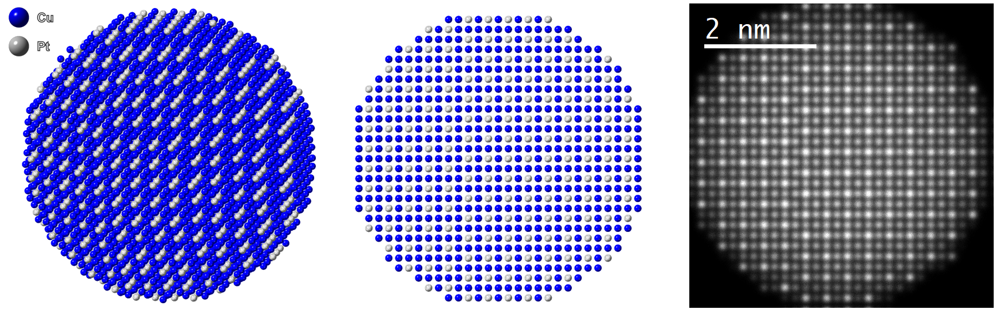

# Defects-in-nanomaterials
Code, used in a study of planar defects in platinum-copper nanoparticles as hydrogen fuel cell electrocatalysts.

This repository contains code to generate crystallographic files of modulated PtCu3 unit cells containing anti-phase boundaries and to simulate diffraction patterns for twinned PtCu3 Pm-3m crystallites, as well as helper functions to generate models of (supported) nanoparticles for STEM image simulation and to plot results for publication.

If you use the code, please cite the following paper: 

* Periodic anti-phase boundaries and crystal superstructures in PtCu3 nanoparticles as fuel cell electrocatalysts. *Materials Today Nano* (2023). https://doi.org/10.1016/j.mtnano.2023.100377

Example of a Pt-Cu nanoparticle model and a corresponding simulated HAADF-STEM image:

  

